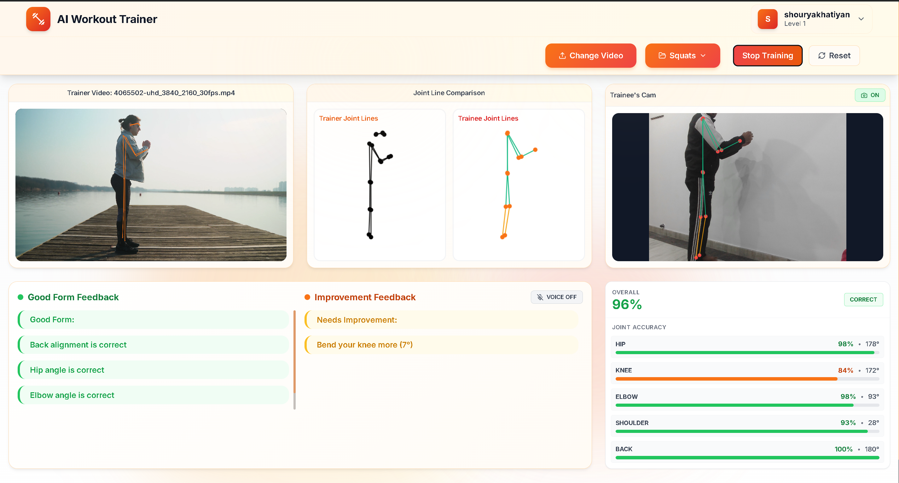

<p align="center">
  
</p>

<h1 align="center"> AI Workout Trainer</h1>

<p align="center">
  <strong>Real-time AI-powered exercise form analysis using pose detection</strong>
</p>

<p align="center">
  <a href="#features">Features</a> •
  <a href="#demo">Demo</a> •
  <a href="#installation">Installation</a> •
  <a href="#usage">Usage</a> •
  <a href="#tech-stack">Tech Stack</a> •
  <a href="#documentation">Docs</a> •
  <a href="#contributing">Contributing</a>
</p>

<p align="center">
  
  
  
  
  
</p>

---

## About

AI Workout Trainer is a web application that uses **TensorFlow.js** and **MoveNet** pose detection to analyze your exercise form in real-time. Load a trainer video, enable your webcam, and get instant feedback on your posture and joint angles.

### Why AI Workout Trainer?

- **Real-time Analysis** - Get instant feedback as you exercise
- **AI-Powered** - Uses Google's MoveNet for accurate pose detection
- **Segment Training** - AI identifies key poses in videos for guided practice
- **Voice Feedback** - Hands-free corrections while you work out
- **Progress Tracking** - Track your accuracy, streaks, XP, and achievements
- **Cloud Sync** - Save your progress across devices securely
- **Privacy Focused** - Video processing happens locally; only stats are synced

---

## Features

### Core Features

| Feature | Description |
|---------|-------------|
| **Pose Detection** | Real-time body keypoint detection using MoveNet |
| **Joint Accuracy** | Track accuracy for hip, knee, elbow, shoulder, and back |
| **Segment Mode** | Auto-analyze videos and train on key pose segments |
| **Form Feedback** | Context-aware tips based on angle direction |
| **Voice Coaching** | Spoken feedback using Web Speech API |
| **Video Comparison** | Follow along with trainer demonstration videos |

### User Features

| Feature | Description |
|---------|-------------|
| **User Profiles** | Create and customize your fitness profile |
| **Cloud Storage** | Sync stats, streaks, and history across devices |
| **Body Calibration** | Enter measurements for personalized analysis |
| **Dashboard** | View workout statistics and progress |
| **Achievements** | Earn 11 badges for milestones |
| **XP and Levels** | Gain experience and level up |
| **Streak Tracking** | Maintain workout consistency |

### Technical Features

- **Supabase Backend** - Secure authentication and database
- **WebGL Acceleration** - GPU-powered pose detection
- **Responsive Design** - Works on desktop and tablets
- **Hot Color Theme** - Vibrant orange/red/amber design
- **Dark/Light Mode** - Theme switching support
- **Local Processing** - Video stream never leaves your device
- **Custom 404 Page** - Themed error page with navigation

---

## Demo

### Trainer Interface

<p align="center">
  
</p>

*The trainer interface showing real-time pose detection, joint accuracy metrics, and form feedback.*

---

## Installation

### Prerequisites

- **Node.js** 18 or higher
- **npm** or **yarn**
- Modern browser with WebGL support
- **Supabase Account** for backend

### Quick Start

1. **Clone the repository**

   ```bash
   git clone https://github.com/shourya-khatiyan/Ai_workout_trainer_web.git
   cd Ai_workout_trainer_web/project
   ```

2. **Install dependencies**

   ```bash
   npm install
   ```

3. **Configure Environment Variables**

   Create a `.env` file in the project root:

   ```env
   VITE_SUPABASE_URL=your_supabase_project_url
   VITE_SUPABASE_ANON_KEY=your_supabase_anon_key
   ```

4. **Start development server**

   ```bash
   npm run dev
   ```

Open [http://localhost:5173](http://localhost:5173) in your browser.

### Build for Production

```bash
# Create production build
npm run build

# Preview production build
npm run preview
```

---

## Usage

### Getting Started

1. **Create Account** - Sign up with your email
2. **Complete Profile** - Add your fitness information
3. **Start Training** - Click "Start Training" from dashboard

### Using the Trainer

1. **Load Video** - Upload a trainer demonstration video
2. **Wait for Analysis** - AI analyzes video for key poses
3. **Enable Camera** - Allow webcam access
4. **Start Session** - Click the play button
5. **Match Poses** - Hold target poses for 1.5 seconds
6. **Check Feedback** - Watch accuracy meters and feedback panel

### Tips for Best Results

- Stand 6-8 feet from your camera
- Ensure good lighting
- Wear contrasting clothes
- Keep full body in frame

---

## Tech Stack

### Frontend

| Technology | Purpose |
|------------|---------|
| [React 18](https://react.dev/) | UI Framework |
| [TypeScript](https://www.typescriptlang.org/) | Type Safety |
| [Vite](https://vitejs.dev/) | Build Tool |
| [Tailwind CSS](https://tailwindcss.com/) | Styling |
| [Framer Motion](https://www.framer.com/motion/) | Animations |
| [React Router](https://reactrouter.com/) | Navigation |
| [Lucide React](https://lucide.dev/) | Icons |

### Backend and AI

| Technology | Purpose |
|------------|---------|
| [Supabase](https://supabase.com/) | Auth and Database |
| [TensorFlow.js](https://www.tensorflow.org/js) | ML Runtime |
| [MoveNet](https://www.tensorflow.org/hub/tutorials/movenet) | Pose Detection |
| Web Speech API | Voice Feedback |

### Development

| Tool | Purpose |
|------|---------|
| ESLint | Code Linting |
| PostCSS | CSS Processing |
| Autoprefixer | Browser Compatibility |

---

## Project Structure

```
src/
├── components/         # Reusable UI components
│   ├── LoadingTransition.tsx
│   ├── Logo.tsx
│   ├── ModelLoadingIndicator.tsx
│   ├── ModelPreloader.tsx
│   ├── Navbar.tsx
│   ├── VideoPlayer.tsx
│   └── VideoPlayer.css
│
├── context/            # React Context providers
│   ├── ThemeContext.tsx
│   └── UserContext.tsx
│
├── pages/              # Page components
│   ├── BodyCalibration.tsx
│   ├── LandingPage.tsx
│   ├── NotFound.tsx
│   ├── Profile.tsx
│   ├── ProfileSetup.tsx
│   ├── SignIn.tsx
│   ├── SignUp.tsx
│   ├── WorkoutTrainer.tsx
│   ├── WorkoutTrainerApp.tsx
│   └── WorkoutTrainerApp.css
│
├── services/           # Business logic
│   ├── authService.ts
│   ├── gamificationService.ts
│   ├── supabase.ts
│   └── voiceFeedbackService.ts
│
├── utils/              # Utility functions
│   ├── index.ts
│   ├── modelUtils.ts
│   ├── navigationUtils.ts
│   ├── poseUtils.ts
│   └── segmentAnalyzer.ts
│
├── App.tsx             # Main app component
├── main.tsx            # Entry point
└── index.css           # Global styles
```

---

## Documentation

| Document | Description |
|----------|-------------|
| [USER_MANUAL.md](./USER_MANUAL.md) | End-user guide with features and troubleshooting |
| [DEVELOPER_MANUAL.md](./DEVELOPER_MANUAL.md) | Developer guide with architecture and API docs |
| [IMPLEMENTATION_MANUAL.md](./IMPLEMENTATION_MANUAL.md) | Detailed implementation guides for major features |

---

## Color Theme

The application uses a **"Hot Colors"** theme:

| Color | Hex | Usage |
|-------|-----|-------|
| Primary | `#F97316` | Buttons, accents |
| Secondary | `#EF4444` | Gradients, alerts |
| Accent | `#FBBF24` | Highlights |

---

## Contributing

Contributions are welcome! Please follow these steps:

1. **Fork** the repository
2. **Create** a feature branch
   ```bash
   git checkout -b feature/amazing-feature
   ```
3. **Commit** your changes
   ```bash
   git commit -m 'Add amazing feature'
   ```
4. **Push** to the branch
   ```bash
   git push origin feature/amazing-feature
   ```
5. **Open** a Pull Request

### Development Guidelines

- Follow TypeScript best practices
- Use meaningful commit messages
- Add comments for complex logic
- Test on multiple browsers

---

## Roadmap

- [ ] Mobile app version
- [ ] More exercise templates
- [ ] Social sharing features
- [ ] Workout history export
- [ ] Multi-language support
- [ ] Custom exercise creation

---

## Known Issues

| Issue | Workaround |
|-------|------------|
| Safari WebGL limited | Use Chrome or Firefox |
| Slow on older devices | Close other tabs |
| Camera permission denied | Check browser settings |

---

## License

This project is licensed under the **ISC License** - see the [LICENSE](LICENSE) file for details.

---

## Author

**Shourya Singh Khatiyan**

- GitHub: [@shourya-khatiyan](https://github.com/shourya-khatiyan)
- Repository: [Ai_workout_trainer_web](https://github.com/shourya-khatiyan/Ai_workout_trainer_web)

---

## Acknowledgments

- [TensorFlow.js Team](https://www.tensorflow.org/js) for the ML framework
- [MoveNet](https://blog.tensorflow.org/2021/05/next-generation-pose-detection-with-movenet-and-tensorflowjs.html) for pose detection model
- [Lucide](https://lucide.dev/) for icons
- [Tailwind CSS](https://tailwindcss.com/) for the styling framework

---

<p align="center">
  Made with looooooots of ☕ by Shourya!!
</p>

<p align="center">
  <a href="#top">Back to Top</a>
</p>
